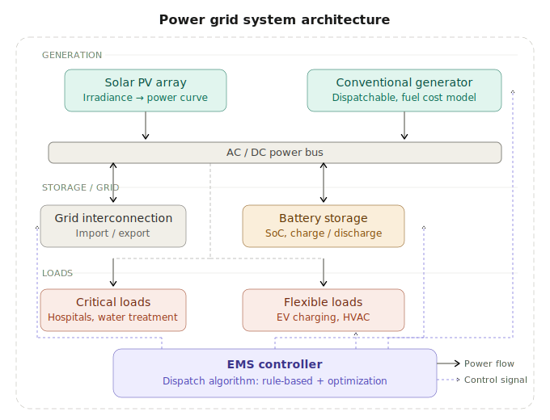
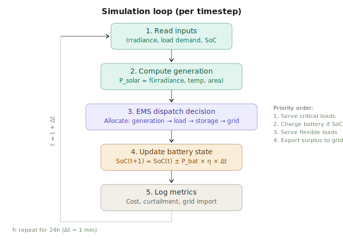

# Power Grid EMS Simulator

A Python-based energy management system (EMS) simulator for modeling power grid operations. Simulates generation dispatch, battery storage, and load balancing across a multi-source grid. Built from scratch with NumPy, SciPy, and matplotlib rather than relying on existing power systems frameworks.

## Why This Project

Reliable power delivery depends on constantly balancing generation with demand, and that problem is getting harder as grids integrate more renewables. Solar and wind output fluctuate with weather, battery storage needs to be charged and discharged at the right times, and certain loads can't afford to lose power.

This simulator models those challenges in a simplified but realistic way. Given a set of generation sources, a battery system, and a load profile, it runs a time-step simulation and determines how to dispatch power at each interval. The goal is to be able to answer practical questions: how much storage do we need to avoid blackouts? What's the cost difference between rule-based and optimized dispatch? How much load do we have to curtail on a cloudy day?

This is also a problem I care about personally. My family has experienced what it's like to live without consistent electricity, and improving energy access in underserved regions is something I want to work on long-term.

## System Architecture

The system is organized around a central power bus. Generation sources feed into the bus, loads draw from it, and the EMS controller determines how power is allocated at each timestep.



**Generation:**
- **Solar PV** - Output is modeled as a function of irradiance, temperature, and panel area. Supports both real-world irradiance data (e.g., NREL NSRDB) and synthetic profiles.
- **Conventional generator** - Dispatchable backup source with fuel consumption and cost modeling. Activated by the EMS when renewables and storage can't meet demand.

**Storage and grid interconnection:**
- **Battery storage** - Tracks state of charge (SoC) over time with configurable capacity, charge/discharge rate limits, round-trip efficiency, and depth-of-discharge constraints.
- **Grid interconnection** - Optional tie to an external grid for importing or exporting power at time-varying rates. Can be disabled to simulate islanded operation.

**Loads:**
- **Critical loads** - Demand that must always be served (hospitals, water treatment, emergency systems). Unserved critical load is tracked as a reliability metric.
- **Flexible loads** - Demand that can be shifted or curtailed when generation is limited (commercial HVAC, EV charging, industrial processes).

## Simulation Loop

The simulator runs a discrete time-step loop, defaulting to 1-minute resolution over a 24-hour period. Each timestep executes five stages:



The EMS dispatch algorithm allocates power using a priority-based strategy:

1. **Serve critical loads.** All available renewable generation goes to critical loads first. If renewables fall short, the battery discharges to cover the gap. If both are insufficient, the conventional generator starts or grid import is used.
2. **Charge the battery.** Excess generation beyond critical demand is used to charge the battery, subject to rate limits and SoC bounds.
3. **Serve flexible loads.** Remaining generation after storage charging goes to flexible loads. These are curtailed if supply is tight.
4. **Export surplus.** Any remaining generation is exported to the grid (grid-tied mode only).

Two dispatch modes are planned: the rule-based priority approach described above, and an optimized approach using linear programming (`scipy.optimize.linprog`) to minimize total system cost over a rolling time horizon.

## Key Metrics

| Metric | Description |
|--------|-------------|
| Self-consumption ratio | Fraction of renewable generation consumed on-site vs. exported |
| Unserved critical load | Total energy demand that could not be met |
| Battery utilization | Cycles per day, average SoC, time at min/max bounds |
| Grid dependency | Net energy imported from the external grid |
| Total system cost | Fuel cost + grid import cost - grid export revenue |
| Load curtailment | Total flexible load energy deferred or shed |

## Project Structure

```
powergrid-ems-simulator/
├── README.md
├── docs/
│   ├── system-architecture.svg
│   └── simulation-loop.svg
├── src/
│   ├── __init__.py
│   ├── solar.py          # Solar PV generation model
│   ├── battery.py        # Battery storage model (SoC tracking)
│   ├── loads.py           # Load profile generation
│   ├── grid.py            # Grid interconnection model
│   ├── generator.py       # Conventional generator model
│   ├── ems.py             # EMS dispatch controller
│   └── simulator.py       # Main simulation loop
├── data/
│   └── profiles/          # Solar irradiance and load profile CSVs
├── tests/
│   ├── test_solar.py
│   ├── test_battery.py
│   └── test_ems.py
├── examples/
│   └── run_24h_sim.py     # 24-hour simulation with output plots
├── requirements.txt
└── .gitignore
```

## Tech Stack

- **Python 3.10+**
- **NumPy** for array operations and time-series data
- **SciPy** for optimization (LP-based dispatch)
- **matplotlib** for visualization (power flow plots, SoC curves, load profiles)

No external power systems frameworks (PyPSA, OpenDSS, etc.) are used. All models are implemented from first principles.

## Roadmap

- [x] System architecture design
- [x] Simulation loop design
- [ ] Solar PV generation model
- [ ] Battery storage model
- [ ] Load profile generator
- [ ] Rule-based EMS dispatch
- [ ] Main simulation loop
- [ ] 24-hour simulation with plots
- [ ] Grid interconnection model (import/export pricing)
- [ ] Conventional generator model
- [ ] Optimized dispatch with scipy LP
- [ ] Real irradiance data from NREL NSRDB

## License

MIT
